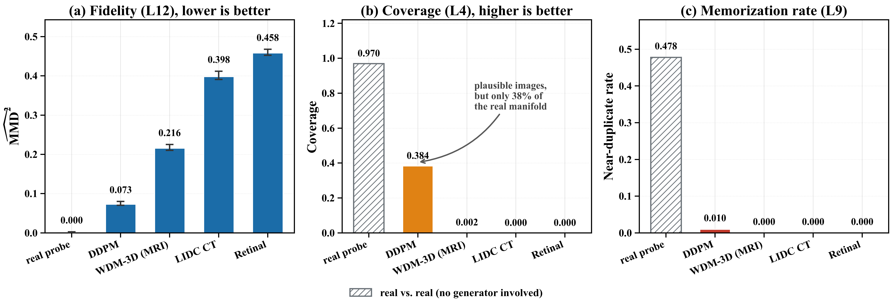
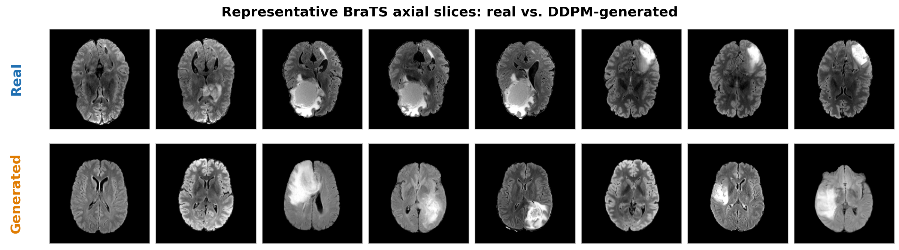
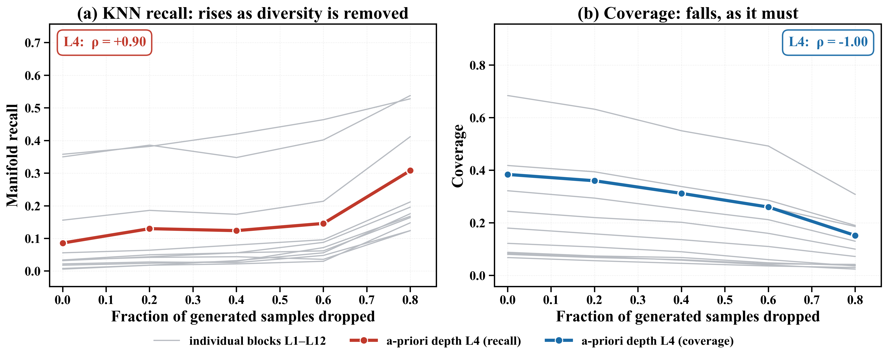
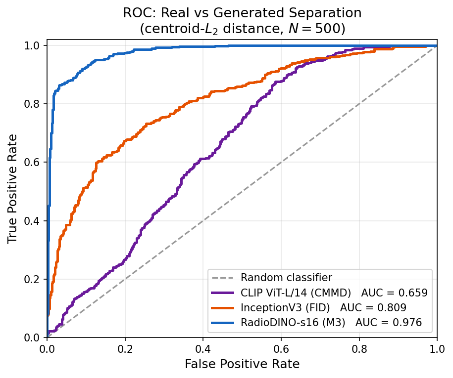
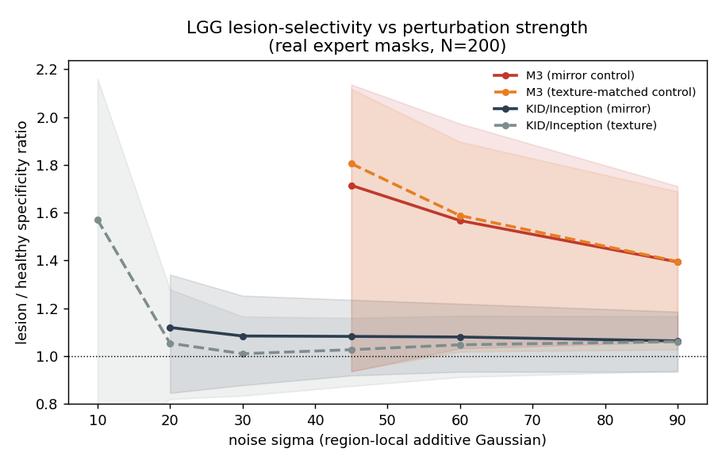

# M3-Score: Academic Project Page

## Fidelity, memorization, and coverage as separate axes for evaluating generative radiology image models

**Author:** Sathiyamohan Nishankar  
**Affiliation:** Department of Computer Engineering, University of Peradeniya, Sri Lanka  
**Status:** Pre-publication research project  
**Repository:** M3-Score reference implementation and experimental record

[Paper PDF](../paper_release/paper.pdf) · [Code](../evaluation/) · [Results](../results/) ·
[Figures](../paper_release/Images/) · [README](../README.md)



## Abstract

Evaluating generative models for radiology image synthesis is difficult because clinically
relevant signals are often rare, localized, and poorly represented by natural-image feature
extractors. A single scalar can also hide an important failure mode: a generator may produce
plausible images while covering only a small part of the real distribution.

M3-Score, the Medical Multi-axis Maximum Mean Discrepancy framework, addresses this problem by
reporting fidelity, memorization, and coverage as separate quantities. The framework uses a
frozen RadioDINO-s16 radiology encoder and assigns each axis to a transformer block fixed a
priori by representational depth. Fidelity is measured with an unbiased multi-bandwidth RBF
MMD^2 at L12, memorization uses nearest-neighbor distances at L9, and coverage uses a real-set
k-NN radius at L4. The fidelity axis is accompanied by a permutation p-value and bootstrap
confidence interval.

The paper validates the framework on subject-diverse BraTS references and controlled perturbation
studies. The results show that fidelity and coverage can disagree, that the standard k-NN
manifold recall can behave perversely under mode removal, and that radiology-specific features
can separate in-domain real and generated images more effectively than ImageNet Inception or
CLIP features in the reported setting.

## Research question

Can generative radiology models be evaluated in a way that distinguishes distributional fidelity,
near-duplicate behavior, and manifold coverage instead of hiding all three in a single score?

The project treats these as different scientific questions:

1. **Fidelity:** Are generated features close to the real feature distribution?
2. **Memorization:** Are generated images suspiciously close to real examples?
3. **Coverage:** Does the generated set represent the diversity of the real set?



## Method

### Radiology-specific representation

M3-Score extracts frozen embeddings from RadioDINO-s16, a radiology-oriented vision transformer.
Using a domain-specific representation is intended to reduce the domain mismatch introduced by
natural-image encoders when evaluating MRI and CT images.

### Fixed axis definitions

The transformer depths are selected before the reported evaluations and are not tuned against
test outcomes:

| Axis | Layer | Definition | Desired direction |
| --- | ---: | --- | :---: |
| Fidelity | L12 | Unbiased multi-bandwidth RBF MMD^2 between real and generated features | lower |
| Memorization | L9 | Fraction of generated images with unusually small nearest-real distances | lower |
| Coverage | L4 | Fraction of real images with a generated neighbor inside the real-set k-NN radius | higher |

The coverage radius is estimated from the real set rather than from the generated subset. This
choice is central to the negative-control experiment because it prevents the reference radius
from shrinking artificially when generated diversity is removed.



## Experimental evidence

The paper reports the following principal observations.

### Fidelity and coverage are not interchangeable

An unconditional DDPM reaches fidelity MMD^2 = 0.073 with a bootstrap 95% confidence interval
of [0.071, 0.080], while covering only 38% of the real manifold. This is the motivating example
for reporting separate axes: plausible distributional proximity does not imply broad coverage.

### Coverage estimator negative control

When generated diversity is progressively removed, conventional k-NN manifold recall rises at
all twelve encoder blocks (Spearman rho = +0.70 to +1.00). The real-radius coverage estimator
falls monotonically at every block (rho = -1.00), matching the intended interpretation of mode
drop.

### Feature-space comparison

With the scoring rule held fixed and only the feature space changed, RadioDINO reaches ROC-AUC
0.819 for separating real brain MRI from in-domain DDPM output. The corresponding reported
values are 0.555 for InceptionV3/FID features and 0.582 for CLIP/CMMD features.



### Sample-size behavior

Across a twenty-fold change in evaluation size on identical data, the reported M3 value changes
by 1.05x, compared with 2.52x for FID. The result supports reporting evaluation size explicitly
and avoiding direct comparison of FID values measured at different sample counts.

### Lesion-specific response

Using expert glioma masks with area-matched and texture-controlled healthy-region perturbations,
M3 responds 1.4-1.8x more strongly to tumor-region perturbations. The reported Inception-MMD
comparison is approximately 1.05x.



## Limitations and proper interpretation

The paper deliberately bounds its claims:

- FID is more repeatable than M3 at fixed sample sizes below 500.
- The layer assignments are a-priori representational choices, not learned optima.
- The fidelity permutation test evaluates a weak null that is rejected by every generator in the
  reported study, so it should be interpreted descriptively rather than as a model-selection
  instrument.
- The framework is scoped to radiology domains represented by the encoder’s pretraining.
- This repository is a research release and does not redistribute medical datasets or model
  checkpoints.

## Repository artifacts

- [`evaluation/`](../evaluation/) contains the metric and baseline implementations.
- [`figures/`](../figures/) contains figure assets and supporting reports.
- [`results/`](../results/) contains numerical outputs, plots, and retained logs.
- [`paper_release/`](../paper_release/) contains the final paper PDF, figures, and build logs.
- [`docs/EXPERIMENT_FINDINGS.md`](EXPERIMENT_FINDINGS.md) contains the dated experiment record.
- [`RELEASE.md`](../RELEASE.md) describes what is intentionally excluded from publication.

## Reproducibility notes

The repository is designed for inspection and reproduction by researchers with access to the
same datasets and pretrained encoders. Before running an evaluation:

1. Install the project dependencies from `requirements.txt`.
2. Obtain the required datasets and checkpoints from their original sources.
3. Keep local data and weights outside the public release paths.
4. Run the evaluation pipeline with fixed seeds and record the sample count.
5. Compare generated reports with the retained JSON results and logs.

## Citation

```bibtex
@article{nishankar2026m3score,
  title   = {M3-Score: Fidelity, Memorization and Coverage as Separate Axes for Evaluating
             Generative Radiology Image Models},
  author  = {Sathiyamohan, Nishankar},
  year    = {2026}
}
```

## Project status

This is an academic project page for a pre-publication repository. Venue-specific submission,
acceptance, and publication claims should be added only after they are officially confirmed.